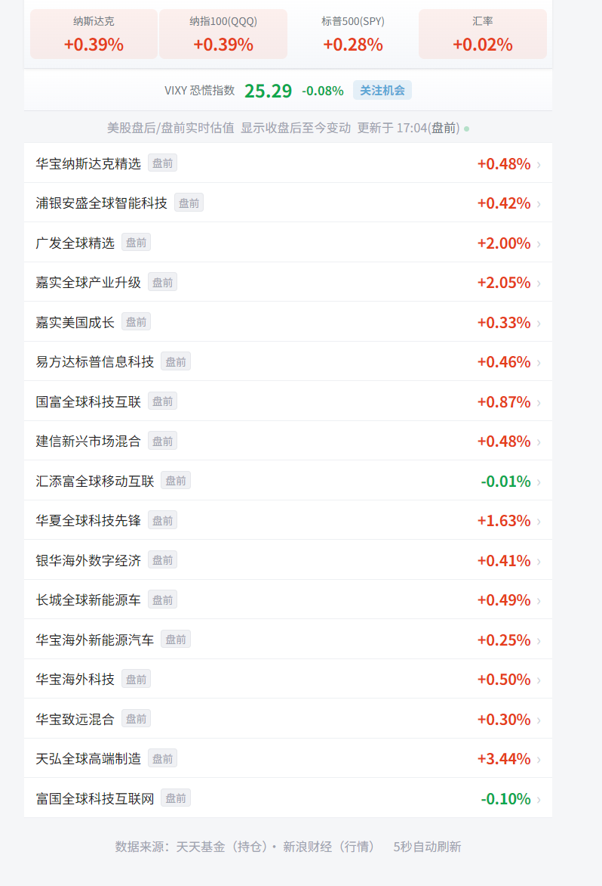

# 美股基金估值

实时追踪美股基金估值变动，支持盘中、盘前/盘后全时段监控。

## 功能特性

- 实时估值：基于基金持仓和美股行情计算基金估值涨跌幅
- 美股24小时：盘后/盘前实时估值，不错过任何波动
- VIXY恐慌指数：4级渐进提醒（关注/逐步买入/加大仓位/重仓买入）
- 多市场覆盖：支持美股、港股、A股、韩股持仓
- 汇率联动：自动计算USD/CNY汇率对基金净值的影响
- 日夜模式：跟随系统自动切换，富途牛牛风格界面
- 智能首页：北京时间5:00-15:00显示盘后列表，15:00-次日5:00显示24小时实时页

## 效果图



## 技术栈

- 前端：原生HTML/CSS/JS单页应用
- 后端：Node.js + Express
- 数据源：天天基金（持仓）、新浪财经（美股行情）、东方财富（港股/A股行情）

## 部署

```bash
npm install
node server.js
```

服务默认运行在 `http://localhost:3000`。

## 数据说明

- 持仓数据来源于基金季报/年报公开披露
- 行情数据5秒自动刷新
- 盘后/盘前价格通过新浪财经接口获取
- 估值仅供参考，不构成投资建议
